# Manual de utilizare WorkSmart — Editor

## Scopul manualului

Acest manual explică modul de lucru al unui **Editor**. În aplicația WorkSmart, contul Editorului are rolul tehnic **PRODUCER**. Editorul creează și organizează sarcinile, le alocă Operatorilor și urmărește progresul echipei.

Funcțiile de administrare a utilizatorilor, configurare avansată, ștergere a programelor, statistici generale și copii de siguranță aparțin Administratorului și nu fac parte din acest manual.

## Cuprins

1. [Autentificarea](#1-autentificarea)
2. [Prima autentificare și parola temporară](#2-prima-autentificare-și-parola-temporară)
3. [Navigarea în aplicație](#3-navigarea-în-aplicație)
4. [Fluxul zilnic recomandat](#4-fluxul-zilnic-recomandat)
5. [Pagina Sarcini și indicatorii echipei](#5-pagina-sarcini-și-indicatorii-echipei)
6. [Crearea unei sarcini](#6-crearea-unei-sarcini)
7. [Editarea și realocarea unei sarcini](#7-editarea-și-realocarea-unei-sarcini)
8. [Ștergerea unei sarcini](#8-ștergerea-unei-sarcini)
9. [Monitorizarea progresului și întârzierilor](#9-monitorizarea-progresului-și-întârzierilor)
10. [Programul echipei și utilizatorii online](#10-programul-echipei-și-utilizatorii-online)
11. [Profilul, statisticile și schimbarea parolei](#11-profilul-statisticile-și-schimbarea-parolei)
12. [Deconectarea](#12-deconectarea)
13. [Probleme frecvente](#13-probleme-frecvente)
14. [Listă rapidă pentru fiecare zi](#14-listă-rapidă-pentru-fiecare-zi)

---

## 1. Autentificarea

1. Deschide aplicația WorkSmart într-un navigator web.
2. Introdu adresa de e-mail asociată contului tău.
3. Introdu parola.
4. Apasă **Autentificare**.
5. După autentificare, aplicația deschide pagina **Sarcini**. Dacă parola este temporară, vei fi trimis la **Setări** pentru schimbarea ei.

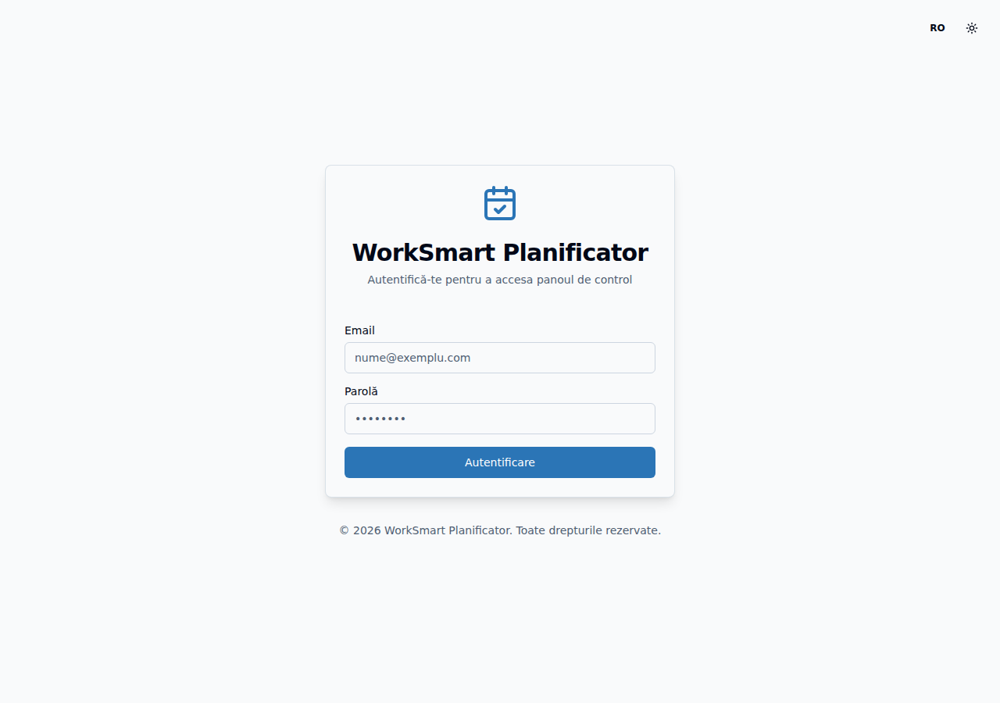

*Pagina de autentificare în limba română, cu datele de acces necompletate.*

### Dacă autentificarea nu reușește

- Verifică adresa de e-mail și parola.
- Verifică dacă tasta **Caps Lock** este activă.
- Elimină eventualele spații introduse accidental.
- Solicită Administratorului resetarea parolei dacă nu o mai cunoști.

## 2. Prima autentificare și parola temporară

1. Autentifică-te cu parola temporară primită.
2. Aplicația deschide automat pagina **Setări**.
3. Deschide fila **Securitate**.
4. Introdu parola temporară în câmpul **Parola curentă**.
5. Introdu o parolă nouă de minimum 12 caractere.
6. Confirmă parola nouă.
7. Apasă **Schimbă parola**.
8. Autentifică-te din nou cu parola nouă.

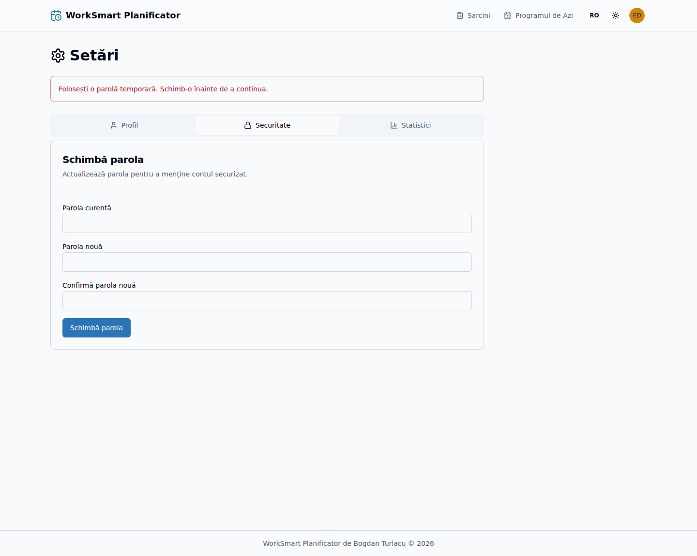

*Avertizarea pentru parola temporară și formularul de schimbare, fără parole vizibile.*

## 3. Navigarea în aplicație

În antet sunt disponibile:

- **Sarcini** — creare, editare, căutare și monitorizare;
- selectorul de limbă;
- selectorul pentru tema luminoasă sau întunecată;
- meniul utilizatorului — profil, setări și deconectare.

Editorul nu are pictogramă pentru notificările Operatorilor și nu are legătură către Panoul Administratorului.

Pe telefon, folosește pictograma de meniu din stânga sus.

*Antetul Editorului pe desktop.*

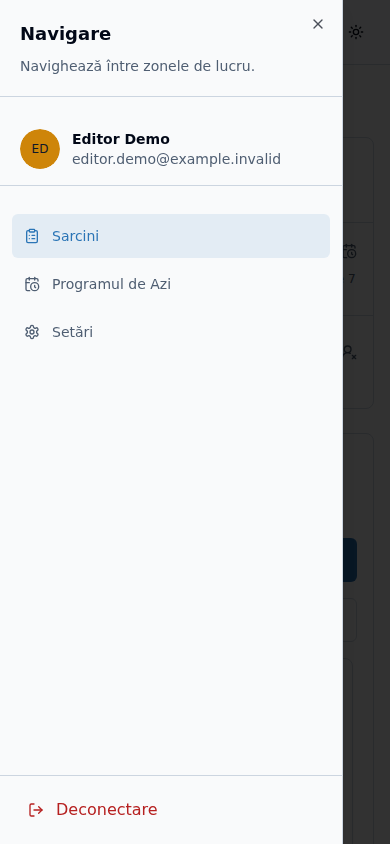

*Meniul mobil, cu principalele zone de lucru și acțiunea de deconectare.*

## 4. Fluxul zilnic recomandat

### La începutul programului

1. Autentifică-te în aplicație.
2. Verifică **Sarcinile echipei astăzi**.
3. Verifică **Sarcinile restante ale echipei**.
4. Verifică sarcinile nealocate.
5. Selectează data curentă în calendar.
6. Consultă **Program Echipă** și utilizatorii afișați ca fiind online.

### În timpul programului

1. Creează sarcinile necesare și alocă fiecare sarcină Operatorului potrivit.
2. Completează clar descrierea, autorul, sursa, prioritatea și data-limită.
3. Verifică dacă sarcina apare în listă după salvare.
4. Urmărește trecerea sarcinilor din **În așteptare** în **În desfășurare** și apoi în **Completată**.
5. Corectează detaliile sau realocă sarcina când este necesar.

### La finalul programului

1. Verifică sarcinile încă active pentru ziua curentă.
2. Verifică sarcinile finalizate cu întârziere.
3. Confirmă pregătirea sarcinilor pentru ziua următoare.

## 5. Pagina Sarcini și indicatorii echipei

În partea de sus sunt afișate:

- **Sarcinile echipei astăzi**;
- **Echipa în următoarele 7 zile**;
- **Sarcinile restante ale echipei**;
- **Active nealocate**;
- numărul sarcinilor finalizate de echipă în ziua curentă.

1. Apasă un indicator pentru a filtra lista.
2. Reține că indicatorii de lucru includ numai sarcinile active.
3. Folosește câmpul **Caută după nume** pentru a găsi rapid o sarcină.
4. Selectează o zi din calendar pentru a vedea sarcinile acelei zile.

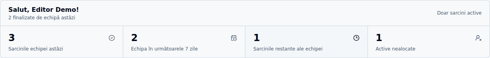

*Indicatorii echipei, cu filtrul sarcinilor restante selectat.*

### Legenda calendarului

- verde — toate sarcinile zilei sunt finalizate;
- roșu — există sarcini nefinalizate;
- culoarea de selecție — data afișată în listă.

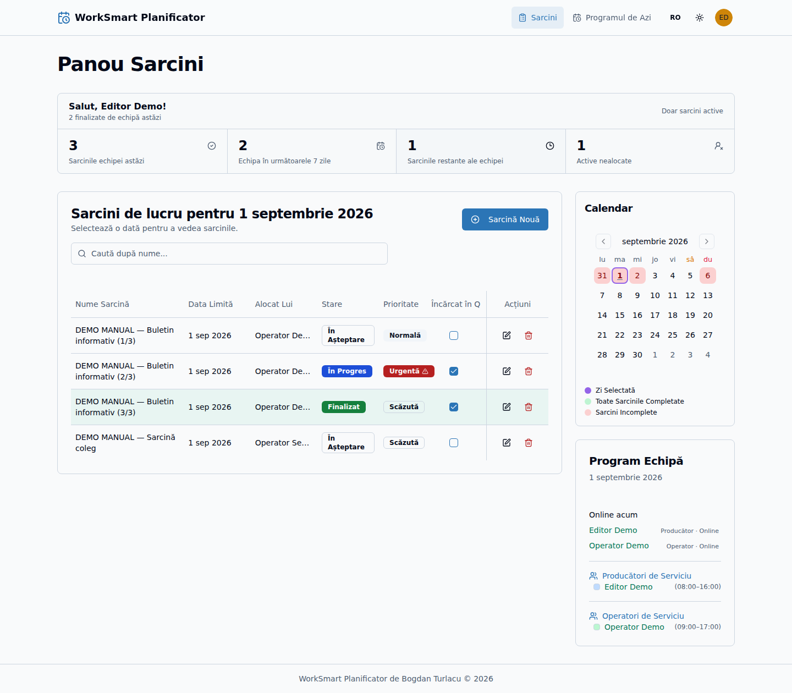

*Lista demonstrativă de sarcini, căutarea, butonul de creare și calendarul.*

## 6. Crearea unei sarcini

### 6.1. Deschiderea formularului

1. Deschide pagina **Sarcini**.
2. Apasă **Sarcină Nouă**.
3. Se deschide formularul pentru o sarcină nouă.

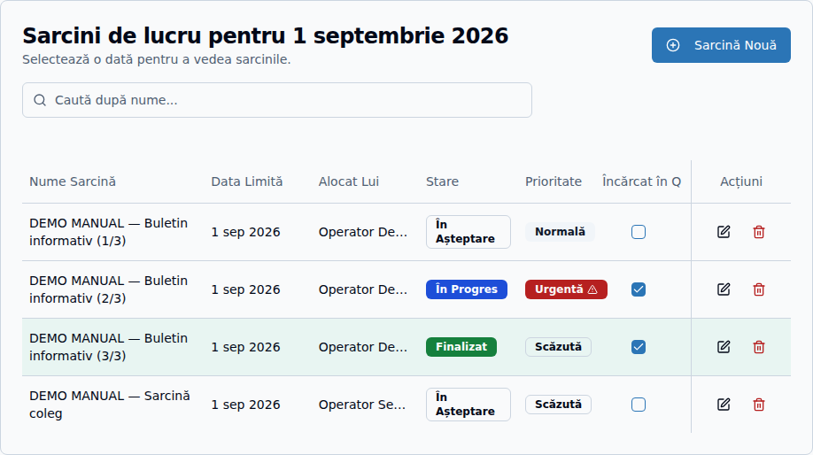

*Butonul „Sarcină Nouă” din pagina Sarcini.*

### 6.2. Completarea câmpurilor

Completează formularul astfel:

1. **Titlu** — scrie o denumire scurtă și ușor de recunoscut.
2. **Descriere** — explică exact lucrarea care trebuie realizată.
3. **Autor** — introdu autorul materialului, dacă informația este disponibilă.
4. **Locația sursei** — indică dosarul, calea sau sursa din care trebuie preluat materialul.
5. **Prioritate** — alege:
   - **Scăzută** pentru lucrări fără urgență;
   - **Normală** pentru fluxul obișnuit;
   - **Urgentă** pentru lucrări care necesită atenție imediată.
6. **Stare** — păstrează starea **În așteptare** pentru o sarcină nouă; etapele ulterioare sunt confirmate de Operator.
7. **Operator** — selectează persoana care va executa sarcina. Poți lăsa sarcina nealocată numai dacă Operatorul nu este încă stabilit.
8. **Data-limită** — selectează ziua în care lucrarea trebuie finalizată.

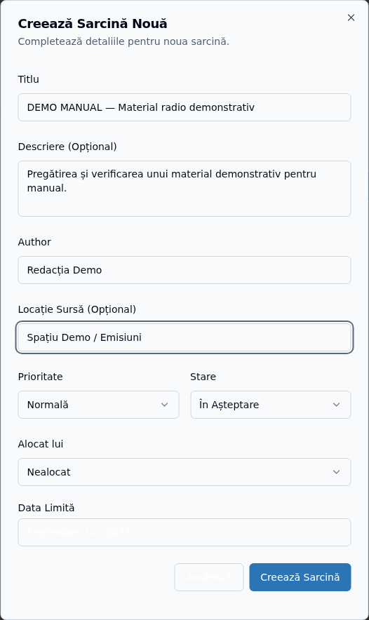

*Formularul completat cu informații exclusiv demonstrative.*

### 6.3. Regula datei-limită

- Poți selecta ziua curentă sau o zi viitoare.
- Nu poți crea o sarcină cu data-limită într-o zi trecută.
- Zilele trecute sunt dezactivate în calendar.
- Dacă o solicitare veche trebuie înregistrată, stabilește o dată validă și explică situația în descriere, conform procedurii interne.

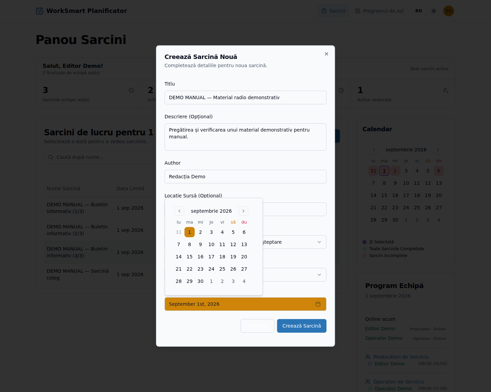

*Calendarul datei-limită, cu zilele trecute dezactivate.*

### 6.4. Salvarea și notificarea Operatorului

1. Verifică toate datele introduse.
2. Apasă **Creează Sarcină**.
3. Așteaptă mesajul de confirmare.
4. Verifică apariția sarcinii în listă.
5. Dacă sarcina a fost alocată unui Operator, acesta primește automat o notificare în timp real.
6. O sarcină nealocată nu generează notificare până când nu este alocată.

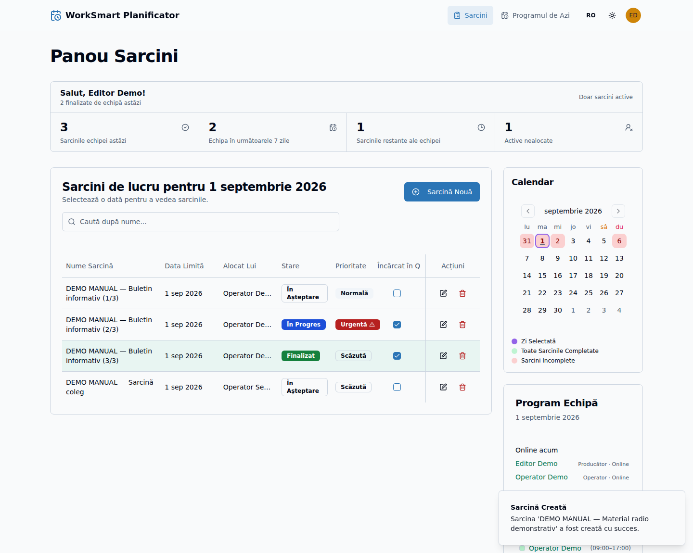

*Mesajul de confirmare și sarcina demonstrativă afișată în listă.*

## 7. Editarea și realocarea unei sarcini

### 7.1. Editarea detaliilor

1. Găsește sarcina în listă.
2. Apasă pictograma sau butonul **Editează**.
3. Modifică informațiile necesare.
4. Verifică Operatorul și data-limită.
5. Apasă **Salvează modificările**.
6. Verifică mesajul de confirmare.

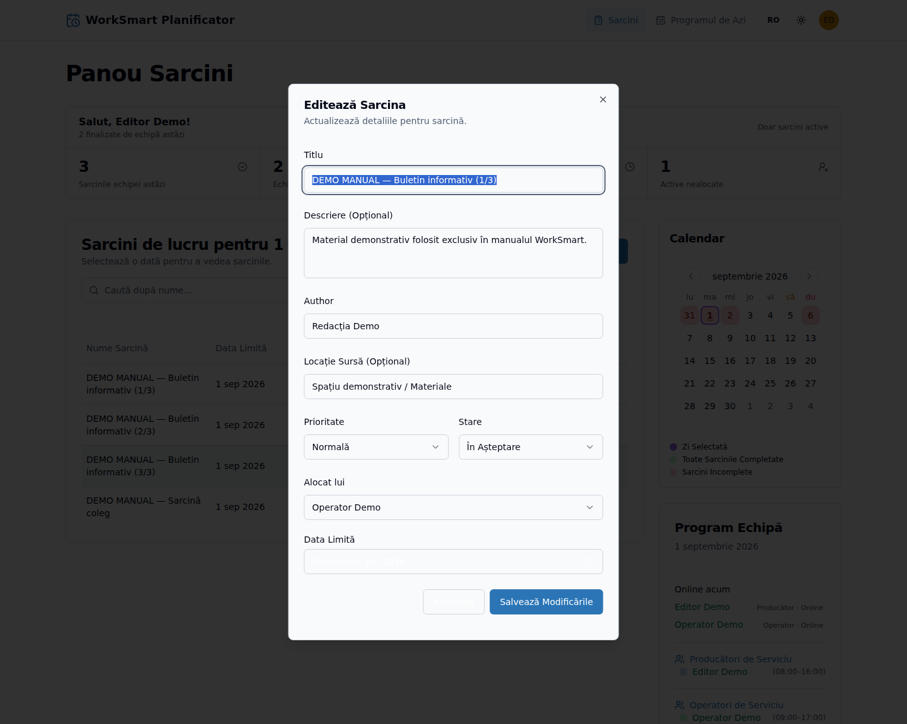

*Acțiunile disponibile și formularul de editare deschis.*

### 7.2. Realocarea către alt Operator

1. Deschide formularul de editare.
2. Selectează noul Operator.
3. Salvează modificarea.
4. Noul Operator primește o notificare.
5. Operatorul anterior nu mai este responsabil de sarcină.

### 7.3. Editarea unei sarcini restante

Pentru o sarcină activă a cărei dată-limită a trecut:

- poți păstra data existentă fără modificare;
- o poți reprograma pentru ziua curentă sau pentru viitor;
- nu o poți muta la o altă dată din trecut.

### 7.4. Sarcinile deja finalizate

După finalizare, data-limită este blocată pentru a păstra corectitudinea statisticilor. Formularul afișează explicația acestei restricții.

Nu modifica starea de lucru a unei sarcini decât atunci când procedura internă permite o corecție. Fluxul normal de finalizare aparține Operatorului.

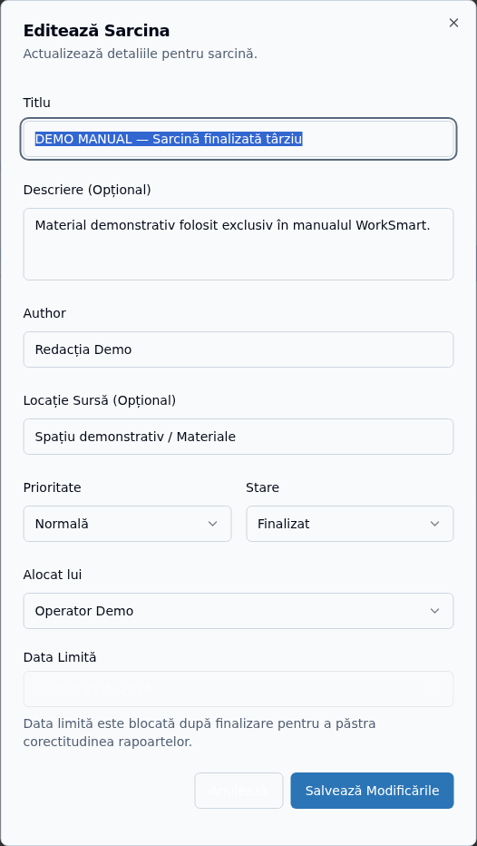

*Selectorul datei-limită dezactivat pentru o sarcină finalizată.*

## 8. Ștergerea unei sarcini

Ștergerea este definitivă și trebuie folosită numai pentru sarcini create din greșeală sau duplicate.

1. Găsește sarcina.
2. Apasă **Șterge**.
3. Citește mesajul de confirmare și verifică denumirea sarcinii.
4. Apasă butonul final de ștergere numai dacă ai identificat sarcina corectă.
5. Verifică dispariția ei din listă.

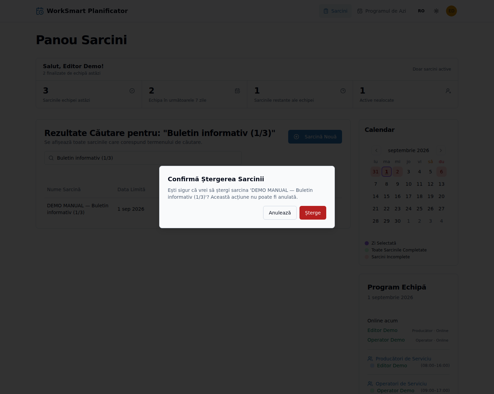

*Fereastra de confirmare înaintea ștergerii.*

> **Important:** Nu șterge o sarcină doar pentru că este restantă sau finalizată cu întârziere. Aceste informații fac parte din istoricul de lucru.

## 9. Monitorizarea progresului și întârzierilor

### Stările unei sarcini

- **În așteptare** — sarcina a fost creată, dar materialul nu este încă încărcat în Q;
- **În desfășurare** — Operatorul a bifat **Încărcat în Q**;
- **Completată** — Operatorul a bifat **Gata**.

Sarcinile completate sunt afișate cu verde.

### Sarcini restante

1. Apasă indicatorul **Sarcinile restante ale echipei**.
2. Identifică sarcinile care au depășit data-limită și sunt încă active.
3. Verifică Operatorul alocat.
4. Realocă sau reprogramează numai dacă situația operațională o cere.

### Sarcini finalizate cu întârziere

O sarcină finalizată într-o zi ulterioară datei-limită rămâne verde, dar afișează o notă precum **Finalizată târziu · 2 zile**.

1. Deschide detaliile sarcinii.
2. Compară data-limită și data finalizării.
3. Reține că întârzierea este păstrată în raportarea generală consultată de Administrator.

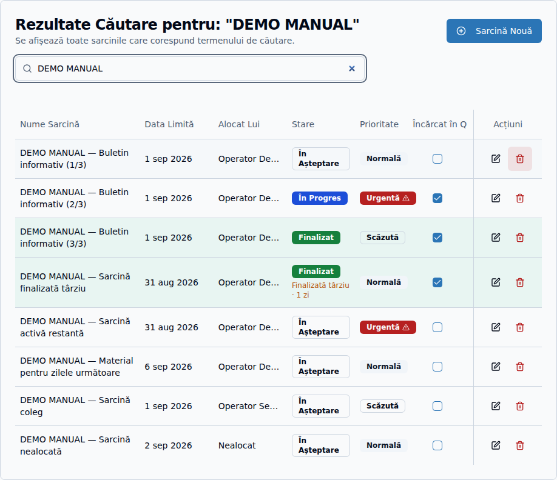

*Diferența dintre o restanță activă și o sarcină finalizată cu întârziere.*

## 10. Programul echipei și utilizatorii online

1. Selectează o zi din calendarul paginii **Sarcini**.
2. Consultă **Producători de serviciu** și **Operatori de serviciu**.
3. Verifică intervalele de lucru afișate.
4. Numele verde indică un utilizator conectat.
5. Secțiunea **Online acum** arată utilizatorii conectați în momentul consultării.

Persoanele aflate în concediu sau configurate cu intervalul `00:00–00:00` nu apar în programul principal pentru ziua respectivă.

*Programul demonstrativ al echipei și utilizatorii online.*

## 11. Profilul, statisticile și schimbarea parolei

### Profilul

1. Apasă avatarul din dreapta sus.
2. Selectează **Setări**.
3. În fila **Profil**, verifică numele, adresa de e-mail și rolul `PRODUCER`.
4. Contactează Administratorul pentru modificarea numelui sau a adresei de e-mail.

### Statisticile personale

1. Deschide fila **Statistici**.
2. Consultă numărul sarcinilor create.
3. Verifică zilele cu activitate, prima și ultima sarcină creată, media zilnică și perioadele cele mai active.

### Schimbarea parolei

1. Deschide fila **Securitate**.
2. Introdu parola curentă.
3. Introdu și confirmă o parolă nouă de minimum 12 caractere.
4. Apasă **Schimbă parola**.
5. Autentifică-te din nou.

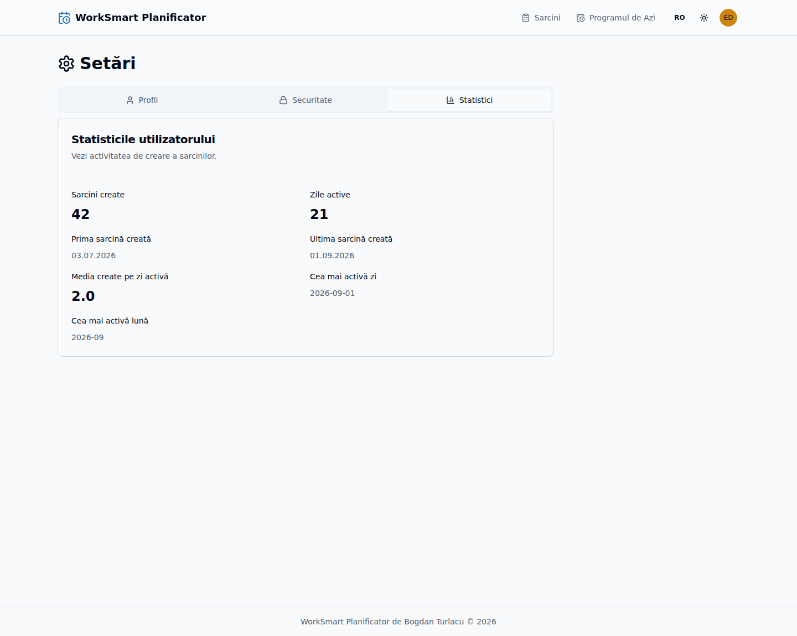

*Fila „Statistici” a Editorului, cu valori demonstrative.*

## 12. Deconectarea

1. Apasă avatarul din dreapta sus sau deschide meniul mobil.
2. Apasă **Deconectare**.
3. Verifică revenirea la pagina de autentificare.

Deconectează-te întotdeauna de pe un calculator folosit de mai multe persoane.

## 13. Probleme frecvente

### Nu pot selecta data dorită pentru o sarcină nouă

Datele trecute sunt blocate intenționat. Selectează ziua curentă sau o dată viitoare.

### Nu pot modifica data-limită a unei sarcini finalizate

Data este blocată pentru a păstra corectitudinea istoricului și statisticilor. Dacă informația este incorectă, contactează Administratorul.

### Operatorul nu a primit notificarea

- Verifică dacă sarcina este alocată Operatorului corect.
- Verifică dacă Operatorul este autentificat.
- Cere Operatorului să consulte pictograma clopoțel și lista notificărilor.
- La realocare, notificarea este trimisă noului Operator.

### Nu găsesc sarcina

- Verifică data selectată.
- Șterge textul din câmpul de căutare.
- Dezactivează filtrul curent prin selectarea din nou sau schimbarea datei.
- Verifică dacă sarcina a fost ștearsă de un utilizator autorizat.

## 14. Listă rapidă pentru fiecare zi

- [ ] Am verificat sarcinile echipei pentru astăzi.
- [ ] Am verificat sarcinile restante și nealocate.
- [ ] Am verificat programul echipei și utilizatorii online.
- [ ] Am creat sarcinile cu instrucțiuni și date-limită corecte.
- [ ] Am alocat fiecare sarcină Operatorului potrivit.
- [ ] Am verificat progresul sarcinilor active.
- [ ] Am verificat sarcinile finalizate cu întârziere.
- [ ] Am pregătit sarcinile pentru ziua următoare.
- [ ] M-am deconectat de pe calculatorul comun.
