# Manual de utilizare WorkSmart — Operator

## Scopul manualului

Acest manual explică, pas cu pas, modul de lucru al unui utilizator cu rolul **Operator**. Operatorul poate consulta programul echipei, poate vedea sarcinile care îi sunt alocate, primește notificări pentru sarcinile noi și actualizează progresul lucrării până la finalizare.

## Cuprins

1. [Autentificarea](#1-autentificarea)
2. [Prima autentificare și parola temporară](#2-prima-autentificare-și-parola-temporară)
3. [Navigarea în aplicație](#3-navigarea-în-aplicație)
4. [Fluxul zilnic recomandat](#4-fluxul-zilnic-recomandat)
5. [Notificările pentru sarcini noi](#5-notificările-pentru-sarcini-noi)
6. [Pagina Sarcini](#6-pagina-sarcini)
7. [Finalizarea corectă a unei sarcini](#7-finalizarea-corectă-a-unei-sarcini)
8. [Sarcinile finalizate cu întârziere](#8-sarcinile-finalizate-cu-întârziere)
9. [Programul echipei și utilizatorii online](#9-programul-echipei-și-utilizatorii-online)
10. [Profilul, statisticile și schimbarea parolei](#10-profilul-statisticile-și-schimbarea-parolei)
11. [Deconectarea](#11-deconectarea)
12. [Probleme frecvente](#12-probleme-frecvente)
13. [Listă rapidă pentru fiecare zi](#13-listă-rapidă-pentru-fiecare-zi)

---

## 1. Autentificarea

1. Deschide aplicația WorkSmart într-un navigator web.
2. În câmpul pentru e-mail, introdu adresa asociată contului tău.
3. În câmpul pentru parolă, introdu parola primită sau parola personală.
4. Apasă butonul **Autentificare**.
5. După autentificare, aplicația deschide pagina **Sarcini**. Dacă folosești încă o parolă temporară, vei fi trimis mai întâi la pagina **Setări**.

*Pagina de autentificare în limba română, cu datele de acces necompletate.*

### Dacă autentificarea nu reușește

- Verifică dacă adresa de e-mail este scrisă complet.
- Verifică dacă tasta **Caps Lock** este activă.
- Introdu parola manual, fără spații înainte sau după aceasta.
- Dacă parola nu mai este cunoscută, solicită administratorului resetarea ei.

## 2. Prima autentificare și parola temporară

O parolă emisă de administrator este temporară. Până când o schimbi, aplicația permite accesul numai la pagina **Setări**.

1. Autentifică-te cu parola temporară.
2. În pagina **Setări**, deschide fila **Securitate**.
3. Introdu parola temporară în câmpul **Parola curentă**.
4. Introdu o parolă nouă de minimum 12 caractere.
5. Repetă parola nouă în câmpul de confirmare.
6. Apasă **Schimbă parola**.
7. Aplicația te deconectează automat.
8. Autentifică-te din nou cu parola nouă.

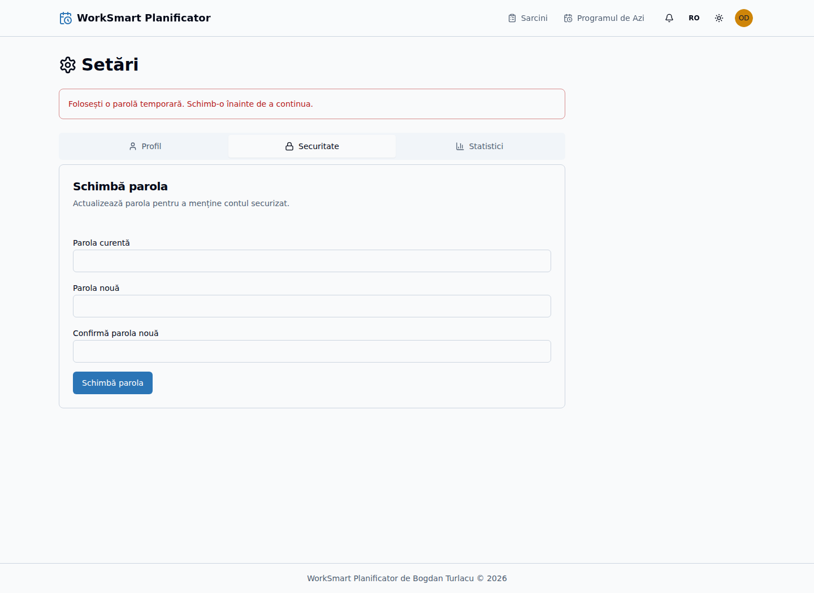

*Avertizarea pentru parola temporară și fila „Securitate”, fără parole vizibile.*

> **Important:** Nu transmite parola altor persoane și nu o păstra într-un document comun.

## 3. Navigarea în aplicație

În partea de sus sunt disponibile principalele zone de lucru:

- **Sarcini** — lista sarcinilor, calendarul și programul echipei;
- **Notificări** — pictograma clopoțel, disponibilă Operatorilor;
- selectorul de limbă;
- selectorul pentru tema luminoasă sau întunecată;
- meniul utilizatorului — profil, setări și deconectare.

Pe telefon, apasă pictograma de meniu din stânga sus pentru a afișa navigarea.

*Antetul Operatorului pe desktop.*

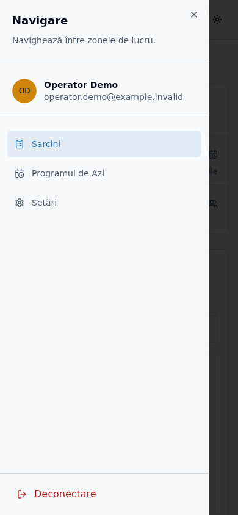

*Meniul mobil, cu principalele zone de lucru și acțiunea de deconectare.*

## 4. Fluxul zilnic recomandat

### La începutul programului

1. Autentifică-te în WorkSmart.
2. Verifică notificările noi din pictograma clopoțel.
3. În pagina **Sarcini**, verifică indicatorul **Sarcinile mele de astăzi**.
4. Verifică indicatorul **Sarcinile mele restante**.
5. Selectează data curentă în calendar.
6. Consultă secțiunea **Program Echipă** pentru a vedea colegii programați și intervalele lor de lucru.

### În timpul programului

1. Deschide sarcina pe care urmează să o execuți.
2. Verifică descrierea, autorul, sursa, prioritatea și data-limită.
3. După încărcarea materialului în Q, bifează **Încărcat în Q**.
4. După finalizarea completă a lucrării, bifează **Gata**.
5. Verifică dacă sarcina apare cu starea **Completată** și cu fundal verde.

### La finalul programului

1. Verifică din nou **Sarcinile mele de astăzi** și **Sarcinile mele restante**.
2. Confirmă că toate lucrările terminate sunt marcate **Gata**.
3. Verifică sarcinile din **Următoarele mele 7 zile** pentru a pregăti activitatea următoare.
4. Deconectează-te dacă folosești un calculator comun.

## 5. Notificările pentru sarcini noi

Când un Editor îți alocă o sarcină, aplicația trimite o notificare în timp real.

### Deschiderea notificării afișate pe ecran

1. Citește mesajul care apare în colțul ecranului.
2. Verifică numele sarcinii, persoana care a alocat-o și data-limită.
3. Apasă **Vezi** pentru a deschide direct sarcina.

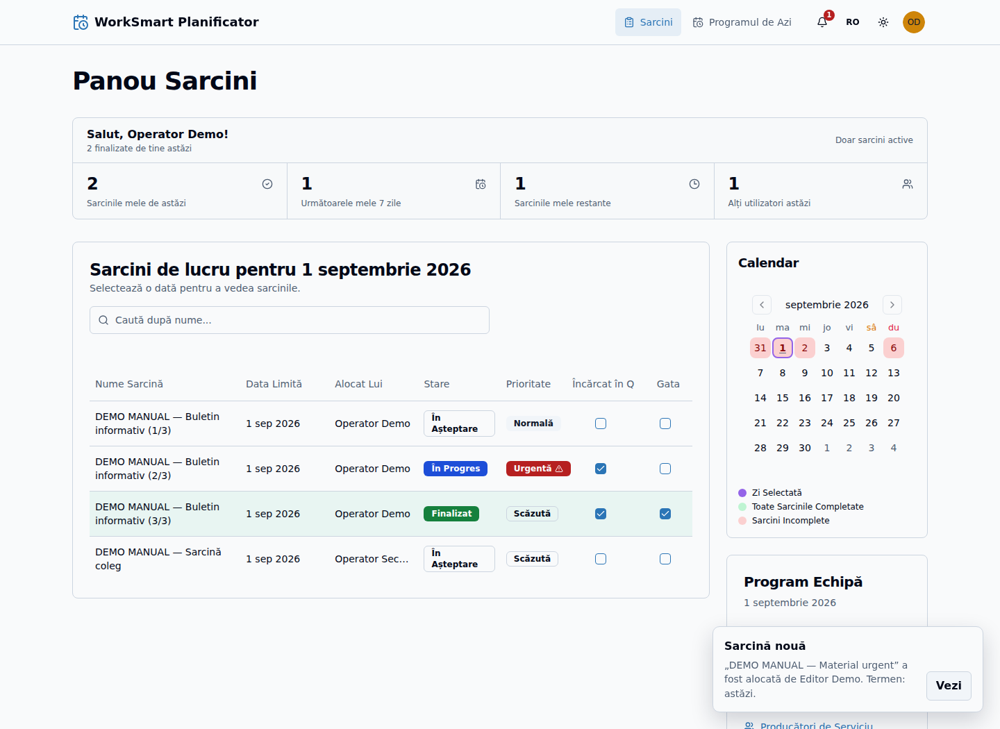

*Notificare demonstrativă în timp real, cu acțiunea „Vezi”.*

### Utilizarea listei de notificări

1. Apasă pictograma clopoțel.
2. Numărul afișat pe pictogramă reprezintă notificările necitite.
3. Apasă o notificare pentru a deschide sarcina asociată.
4. Folosește **Marchează toate ca citite** pentru a elimina marcajele de necitit.
5. Dacă lista este lungă, folosește **Încarcă mai multe**.

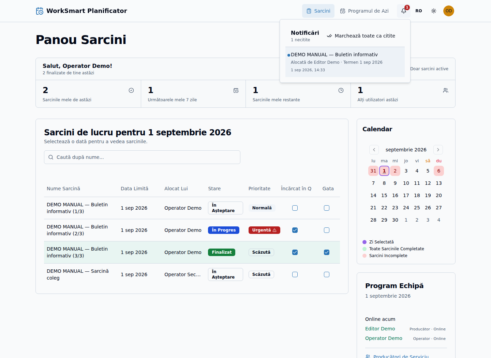

*Lista notificărilor, cu o notificare necitită și acțiunea pentru marcarea tuturor ca citite.*

## 6. Pagina Sarcini

### 6.1. Indicatorii personali

În partea de sus sunt afișate:

- **Sarcinile mele de astăzi**;
- **Următoarele mele 7 zile**;
- **Sarcinile mele restante**;
- **Alți utilizatori astăzi**;
- numărul sarcinilor finalizate de tine în ziua curentă.

Apasă un indicator pentru a filtra lista. Indicatorii de lucru includ numai sarcini active, nu și sarcinile deja finalizate.

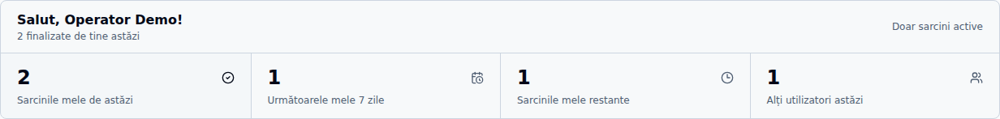

*Salutul personalizat și indicatorii de lucru ai Operatorului.*

### 6.2. Căutarea unei sarcini

1. Apasă în câmpul **Caută după nume**.
2. Introdu o parte din denumirea sarcinii.
3. Lista se actualizează cu rezultatele corespunzătoare.
4. Șterge textul introdus pentru a reveni la afișarea normală.

### 6.3. Selectarea unei date

1. Folosește săgețile calendarului pentru a schimba luna.
2. Apasă data dorită.
3. Lista de sarcini se actualizează pentru data selectată.
4. Consultă legenda calendarului:
   - verde — toate sarcinile zilei sunt finalizate;
   - roșu — există sarcini nefinalizate;
   - culoarea de selecție — data afișată în prezent.

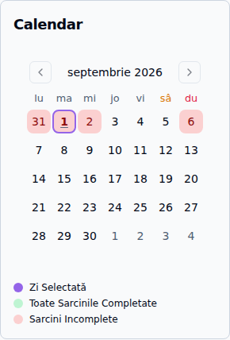

*Calendarul lunar și legenda stărilor sarcinilor.*

### 6.4. Citirea unei sarcini

În listă poți vedea denumirea, data-limită, Operatorul alocat, starea, prioritatea și etapele de lucru.

1. Apasă denumirea sarcinii.
2. Citește toate informațiile din fereastra cu detalii.
3. Verifică în special:
   - descrierea;
   - autorul;
   - locația sau sursa materialului;
   - prioritatea;
   - persoana căreia îi este alocată sarcina;
   - data-limită;
   - persoana care a creat sau actualizat sarcina.
4. Apasă **Închide** pentru a reveni la listă.

Câmpul pentru comentarii nu face parte din fluxul operațional actual și nu trebuie folosit pentru transmiterea informațiilor importante.

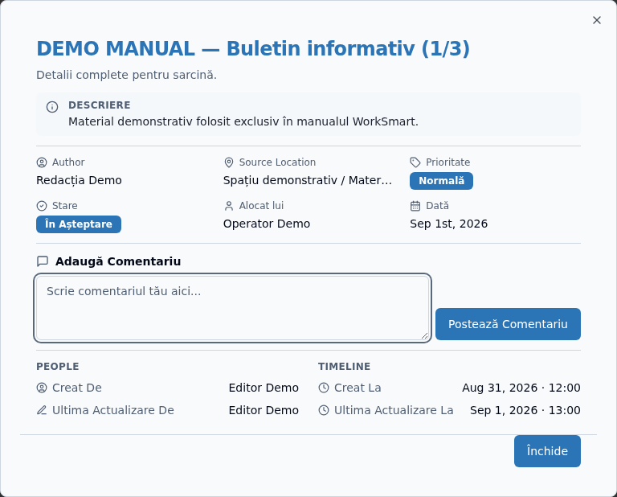

*Detaliile unei sarcini demonstrative.*

> **Important:** Actualizează starea numai pentru sarcinile care îți sunt alocate.

## 7. Finalizarea corectă a unei sarcini

Fluxul trebuie respectat în ordinea următoare:

### Etapa 1 — Sarcină în așteptare

Sarcina nouă apare cu starea **În așteptare**. Citește toate instrucțiunile înainte de a modifica starea.

### Etapa 2 — Încărcat în Q

1. Finalizează pregătirea materialului.
2. Încarcă materialul în sistemul Q utilizat de organizație.
3. Revino în WorkSmart.
4. Bifează **Încărcat în Q**.
5. Sarcina trece în starea **În desfășurare**.

### Etapa 3 — Gata

1. Verifică dacă **Încărcat în Q** este deja bifat.
2. Confirmă că lucrarea este complet finalizată.
3. Bifează **Gata**.
4. Sarcina trece în starea **Completată** și este afișată cu verde.

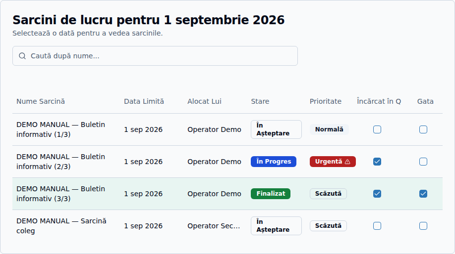

*Exemplu demonstrativ pentru stările „În așteptare”, „În progres” și „Finalizat”.*

### Reguli importante

- Nu poți bifa **Gata** înainte de **Încărcat în Q**.
- După ce un Operator bifează **Încărcat în Q**, anularea acestei etape necesită intervenția unui Administrator.
- După ce o sarcină este marcată **Gata**, numai un Administrator o poate redeschide.
- Dacă ai bifat greșit o etapă, anunță imediat Administratorul.

## 8. Sarcinile finalizate cu întârziere

O sarcină este considerată finalizată cu întârziere dacă este marcată **Gata** într-o zi ulterioară datei-limită.

- Sarcina rămâne verde deoarece este finalizată.
- Sub starea ei apare o notă discretă, de exemplu **Finalizată târziu · 2 zile**.
- În fereastra cu detalii sunt afișate data-limită și data finalizării.
- Întârzierea este inclusă în statisticile aplicației.

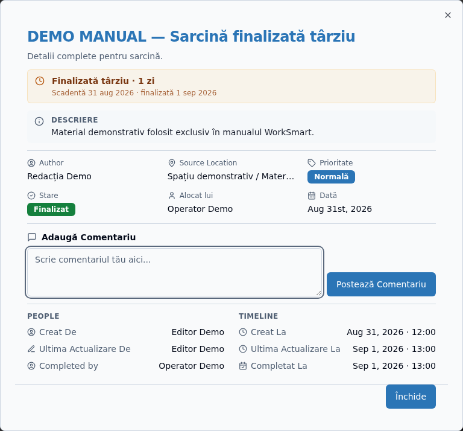

*Marcajul de finalizare întârziată, data-limită și data finalizării.*

## 9. Programul echipei și utilizatorii online

În partea dreaptă a paginii **Sarcini** se află secțiunea **Program Echipă** pentru data selectată.

1. Selectează o zi din calendar.
2. Verifică lista **Producători de serviciu**.
3. Verifică lista **Operatori de serviciu**.
4. Consultă intervalul de lucru afișat lângă fiecare nume.
5. Numele afișat cu verde indică un utilizator conectat în acel moment.
6. Secțiunea **Online acum** prezintă utilizatorii conectați, indiferent de data selectată în calendar.

Persoanele cu program de tip concediu sau cu intervalul `00:00–00:00` nu sunt afișate ca fiind în serviciu.

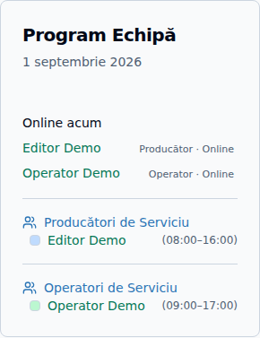

*Programul demonstrativ al echipei și utilizatorii online.*

## 10. Profilul, statisticile și schimbarea parolei

### Profilul

1. Apasă avatarul din dreapta sus.
2. Selectează **Setări**.
3. În fila **Profil**, verifică numele, adresa de e-mail și rolul.
4. Pentru modificarea numelui sau a adresei de e-mail, contactează Administratorul.

### Statisticile personale

1. În **Setări**, deschide fila **Statistici**.
2. Consultă numărul total de sarcini finalizate.
3. Verifică prima și ultima finalizare, zilele cu activitate, media zilnică și perioada cea mai activă.

### Schimbarea parolei

1. Deschide fila **Securitate**.
2. Introdu parola curentă.
3. Introdu și confirmă o parolă nouă de minimum 12 caractere.
4. Apasă **Schimbă parola**.
5. Autentifică-te din nou cu parola nouă.

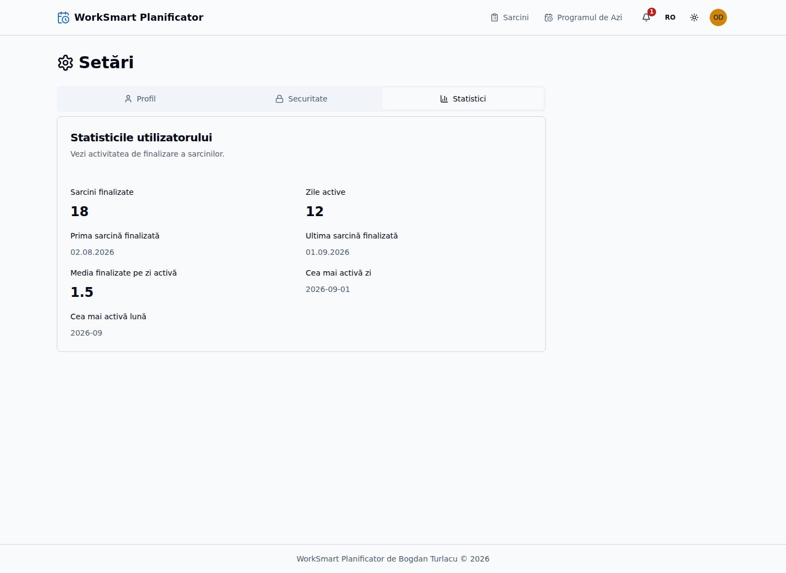

*Fila „Statistici” din Setările Operatorului.*

## 11. Deconectarea

1. Apasă avatarul din dreapta sus sau deschide meniul de pe telefon.
2. Apasă **Deconectare**.
3. Verifică revenirea la pagina de autentificare.

Deconectează-te întotdeauna când folosești un calculator comun.

## 12. Probleme frecvente

### Nu văd sarcina așteptată

- Verifică data selectată în calendar.
- Șterge textul din câmpul de căutare.
- Apasă indicatorul personal corespunzător.
- Verifică notificarea primită.
- Dacă sarcina nu îți este alocată, contactează Editorul.

### Nu pot bifa „Gata”

- Verifică dacă sarcina îți este alocată.
- Bifează mai întâi **Încărcat în Q**.
- Reîncarcă pagina și încearcă din nou.

### Am bifat greșit o etapă

Operatorul nu poate anula singur o etapă confirmată. Contactează Administratorul și precizează denumirea sarcinii.

### Nu primesc notificări în timp real

- Verifică dacă ești autentificat cu rolul Operator.
- Reîncarcă pagina.
- Verifică pictograma clopoțel; notificarea poate exista deja în listă.
- Verifică legătura la internet.

## 13. Listă rapidă pentru fiecare zi

- [ ] M-am autentificat cu propriul cont.
- [ ] Am verificat notificările noi.
- [ ] Am verificat sarcinile de astăzi și sarcinile restante.
- [ ] Am consultat programul echipei.
- [ ] Am citit detaliile înainte de a începe fiecare sarcină.
- [ ] Am bifat **Încărcat în Q** numai după încărcarea materialului.
- [ ] Am bifat **Gata** numai după finalizarea completă.
- [ ] Am verificat sarcinile pentru următoarele zile.
- [ ] M-am deconectat de pe calculatorul comun.
